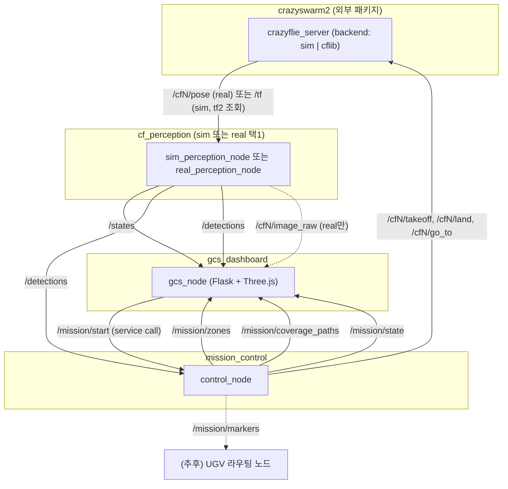
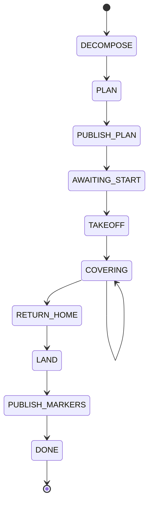
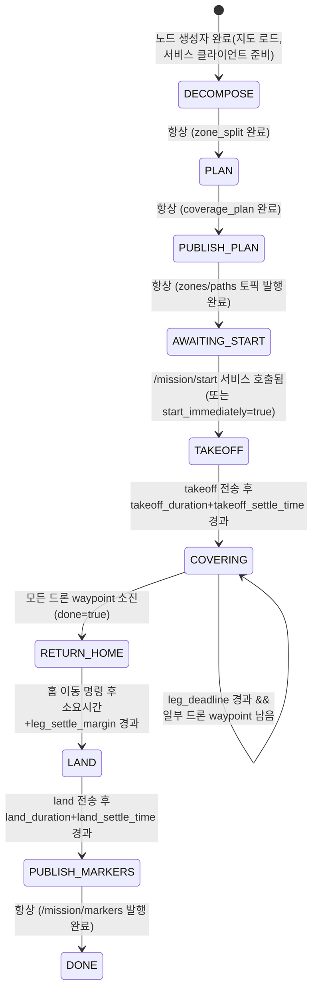
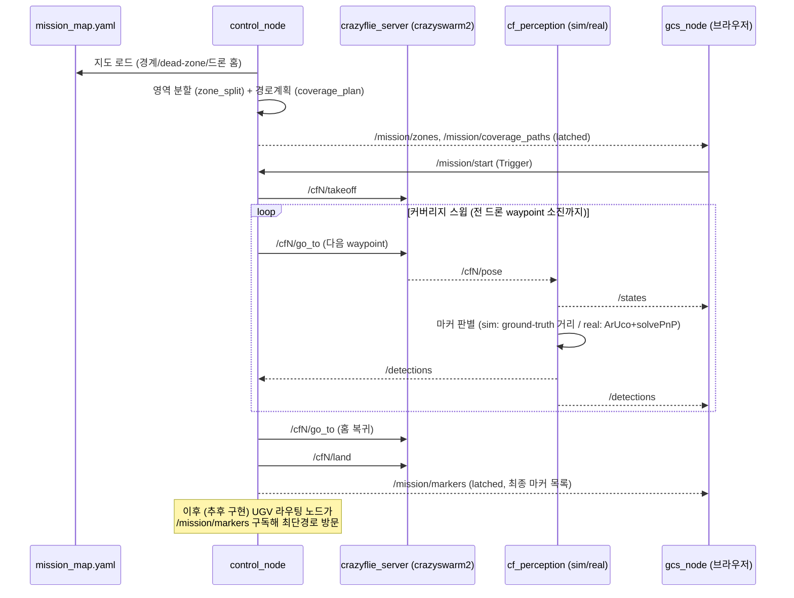

# UAV(Crazyflie)-UGV(ST-mini) 협동 정찰 시스템

사전에 알려진 다각형 정찰구역(내부 dead-zone 포함) 안에서 Crazyflie 3대가 협동 탐색으로 무작위 위치의 아루코 마커를 찾고, 좌표를 ST-mini(UGV)에 전달하는 ROS 2 시스템입니다. 이 저장소는 그중 **1단계(임무영역 할당·경로계획)**와 **2단계(크레이지플라이 탐색)**를 다룹니다. UGV 방문 단계는 다음 작업에서 별도 패키지로 추가될 예정입니다.

> 빌드/실행 방법과 실행 전 체크리스트는 [docs/RUNNING.md](docs/RUNNING.md) 참고.

## 목차

1. [시스템 개요](#1-시스템-개요)
2. [ROS 패키지 구조](#2-ros-패키지-구조)
3. [노드 및 토픽 구조](#3-노드-및-토픽-구조)
4. [상태 머신](#4-상태-머신)
5. [`mission_interfaces` 패키지 상세](#5-mission_interfaces-패키지-상세)
6. [`mission_control` 패키지 상세](#6-mission_control-패키지-상세)
7. [`cf_perception` 패키지 상세](#7-cf_perception-패키지-상세)
8. [`gcs_dashboard` 패키지 상세](#8-gcs_dashboard-패키지-상세)
9. [런치 파일 구조](#9-런치-파일-구조)
10. [전체 데이터 흐름 요약](#10-전체-데이터-흐름-요약)

---

## 1. 시스템 개요

- **하드웨어**: Crazyflie 3대(UAV) + ST-mini 위 Jetson(UGV, 메인 컴퓨터) 1대.
- **제어 방식**: 완전 중앙집중식. `control_node` 하나가 상태머신을 돌리며 3대 드론을 직접 지휘한다.
- **시뮬-실기체 이식성**: 위치 텔레메트리(`/cfN/pose`)는 crazyswarm2가 sim/real 백엔드에 상관없이 동일한 토픽으로 제공하므로, 우리 코드가 직접 만드는 것은 "카메라/마커 인식" 부분뿐이다. 이 부분만 `cf_perception` 패키지 안에서 `sim_perception_node`(ground-truth 참고) / `real_perception_node`(실제 영상+ArUco)로 나뉘고, 나머지 노드(`control_node`, `gcs_node`)는 시뮬/실기체 구분 없이 완전히 동일한 코드로 동작한다.
- **알고리즘 성격**: 임무영역 분할(cellular decomposition)과 커버리지 경로계획(coverage path planning)은 의도적으로 **나이브한 베이스라인**(세로 스트립 분할 + boustrophedon)이다. 비효율적이어도 무방하며, 추후 논문 알고리즘으로 `mission_control` 내부 모듈만 교체하면 되도록 인터페이스를 고정해 두었다.
- **로버 단계 제외**: 이번 범위는 `/mission/markers` 토픽 발행까지이며, 이 좌표들을 방문하는 UGV 라우팅/실행 노드는 이후 별도로 추가한다.

## 2. ROS 패키지 구조

```
uav-ugv-cooperation2/
└── ros2_ws/
    └── src/
        ├── mission_interfaces/       # 커스텀 메시지 정의 (ament_cmake)
        │   └── msg/
        │       ├── DroneState.msg
        │       ├── MarkerDetection.msg
        │       ├── ZoneAssignment.msg / ZoneAssignmentArray.msg
        │       ├── CoveragePath.msg / CoveragePathArray.msg
        │       ├── DroneProgress.msg / DroneProgressArray.msg
        │       └── MarkerRecord.msg / MarkerRecordArray.msg
        │
        ├── mission_control/          # 중앙 상태머신 (ament_python)
        │   └── mission_control/
        │       ├── control_node.py     # 유일한 지휘자 노드
        │       ├── zone_split.py       # 나이브 임무영역 분할 (Shapely)
        │       └── coverage_plan.py    # 나이브 boustrophedon 경로계획 (Shapely)
        │
        ├── cf_perception/            # 드론 정보 수신 (ament_python)
        │   ├── cf_perception/
        │   │   ├── sim_perception_node.py   # 시뮬: pose 중계 + ground-truth 마커 체크
        │   │   └── real_perception_node.py  # 실기체: WiFi 영상 + ArUco 검출
        │   └── config/
        │       └── camera_intrinsics.yaml   # AI-deck 카메라 파라미터 (placeholder)
        │
        ├── gcs_dashboard/            # 지상국 대시보드 (ament_python)
        │   └── gcs_dashboard/
        │       ├── gcs_node.py            # Flask + rclpy 백그라운드 스레드
        │       ├── templates/index.html   # 대시보드 페이지
        │       └── static/                # Three.js(vendored) + app.js + OrbitControls.js
        │
        └── mission_bringup/          # 런치/설정 통합 (ament_cmake)
            ├── launch/
            │   ├── sim.launch.py
            │   └── real.launch.py
            └── config/
                ├── mission_map.yaml     # 정찰구역 지도 (경계/dead-zone/드론 홈/UGV 시작위치)
                ├── true_markers.yaml    # 시뮬 전용 ground-truth 마커 좌표
                └── crazyflies.yaml      # crazyswarm2 표준 로봇 설정
```

패키지는 5개로 최대한 flat하게 유지했다 (알고리즘 교체는 `mission_control` 내부 두 파일만 갈아끼우면 충분).

## 3. 노드 및 토픽 구조

### 3.1 노드 그래프



**토픽/서비스 요약표** (노드별 subscribe / publish):

| 노드                             | Subscribe                                                                                                      | Publish                                                                           | 비고                                                                                            |
| -------------------------------- | -------------------------------------------------------------------------------------------------------------- | --------------------------------------------------------------------------------- | ----------------------------------------------------------------------------------------------- |
| `crazyflie_server` (crazyswarm2) | -                                                                                                              | `/cfN/pose` (x3)                                                                  | sim/real 백엔드 모두 동일 토픽                                                                  |
| `control_node`                   | `/detections`, `/states`(실측 위치 피드백)                                                                     | `/mission/zones`, `/mission/coverage_paths`, `/mission/progress`, `/mission/state`, `/mission/markers` | `/cfN/takeoff`,`/cfN/land`,`/cfN/go_to` 서비스 **클라이언트**, `/mission/start` 서비스 **서버** |
| `sim_perception_node`            | `/tf` (tf2 조회, `world→cfN`)                                                                                   | `/states`, `/detections`                                                          | sim 백엔드는 `/cfN/pose`를 발행하지 않아 tf2로 위치를 얻음. `true_markers.yaml`(ground-truth)은 이 노드만 읽음 |
| `real_perception_node`           | `/cfN/pose` (x3)                                                                                               | `/states`, `/detections`, `/cfN/image_raw` (x3)                                   | AI-deck WiFi 소켓에서 직접 영상 수신(토픽 아님)                                                 |
| `gcs_node`                       | `/states`, `/detections`, `/mission/zones`, `/mission/coverage_paths`, `/mission/progress`, `/mission/state`, `/cfN/image_raw` (x3) | -                                                                                 | `/mission/start` 서비스 **클라이언트** (REST `/api/mission/start`로 트리거)                     |

### 3.2 노드별 역할

| 패키지             | 노드                   | 실행 파일              | 역할                                                                                                            |
| ------------------ | ---------------------- | ---------------------- | --------------------------------------------------------------------------------------------------------------- |
| `mission_control`  | `control_node`         | `control_node`         | 지도 로드 → 영역분할 → 경로계획 → 발행 → 이륙/커버리지/복귀/착륙 지휘 → 최종 마커 발행. 유일한 중앙 상태머신    |
| `cf_perception`    | `sim_perception_node`  | `sim_perception_node`  | (시뮬) `/cfN/pose` → `/states` 중계, ground-truth 마커와 거리 비교해 `/detections` 발행                         |
| `cf_perception`    | `real_perception_node` | `real_perception_node` | (실기체) `/cfN/pose` → `/states` 중계, AI-deck WiFi 영상 수신+ArUco 검출 → `/detections`, `/cfN/image_raw` 발행 |
| `gcs_dashboard`    | `gcs_node`             | `gcs_node`             | ROS 토픽을 스레드락 걸린 상태로 모아 Flask REST API로 노출, 브라우저의 Three.js 3D 대시보드에 서빙              |
| (외부) `crazyflie` | `crazyflie_server`     | crazyswarm2 제공       | 드론 저수준 통신 담당(시뮬 물리 또는 실제 라디오/WiFi), `/cfN/pose` 발행 및 takeoff/land/go_to 서비스 제공      |

### 3.3 커스텀 메시지 정의

모두 `mission_interfaces` 패키지에 정의되어 있다.

| 메시지                | 필드                                                                                  | 발행 토픽                 | QoS                                    |
| --------------------- | ------------------------------------------------------------------------------------- | ------------------------- | -------------------------------------- |
| `DroneState`          | `Header header`, `string drone_id`, `geometry_msgs/Point position`, `float32 yaw`     | `/states`                 | Reliable, volatile                     |
| `MarkerDetection`     | `Header header`, `string drone_id`, `int32 marker_id`, `geometry_msgs/Point position` | `/detections`             | Reliable, volatile                     |
| `ZoneAssignment`      | `string drone_id`, `geometry_msgs/Polygon[] polygons`                                 | (배열로 래핑)             | -                                      |
| `ZoneAssignmentArray` | `ZoneAssignment[] zones`                                                              | `/mission/zones`          | Reliable, **Transient Local**(latched) |
| `CoveragePath`        | `string drone_id`, `nav_msgs/Path path`                                               | (배열로 래핑)             | -                                      |
| `CoveragePathArray`   | `CoveragePath[] paths`                                                                | `/mission/coverage_paths` | Reliable, **Transient Local**(latched) |
| `DroneProgress`       | `string drone_id`, `int32 waypoint_index`, `int32 total_waypoints`                    | (배열로 래핑)             | -                                      |
| `DroneProgressArray`  | `DroneProgress[] progress`                                                            | `/mission/progress`       | Reliable, volatile                     |
| `MarkerRecord`        | `int32 marker_id`, `geometry_msgs/Point position`                                     | (배열로 래핑)             | -                                      |
| `MarkerRecordArray`   | `MarkerRecord[] markers`                                                              | `/mission/markers`        | Reliable, **Transient Local**(latched) |

`ZoneAssignment.polygons`가 배열인 이유: zone은 폴리곤이 아니라 grid cell들의 집합이라, 셀 하나당 작은 사각형 폴리곤 하나씩 담아 배열로 보낸다(`control_node`의 `_publish_plan()` 참고) — 그래서 GCS 바닥에는 하나로 이어진 색칠 영역이 아니라 "칠해진 셀들의 모자이크"가 보인다. 표준 메시지도 그대로 재사용한다 — `sensor_msgs/Image`(`/cfN/image_raw`), `std_msgs/String`(`/mission/state`), `std_srvs/Trigger`(`/mission/start`).

## 4. 상태 머신

이 시스템의 상태머신은 **`control_node` 하나뿐**이다. 중앙집중 제어이므로 드론별 실행 노드를 따로 두지 않고, `control_node`가 각 드론의 waypoint 진행 상태(`wp_index`, `done` 플래그)를 **내부 변수로만** 들고 있다. 따라서 상태 다이어그램은 아래 하나로 충분하다.

`COVERING` 상태 내부에서 드론별로 추적하는 값은 다음과 같다 (별도 상태머신이 아니라 `COVERING` 상태 안의 보조 데이터임을 참고):

| 내부 변수        | 의미                                                |
| ---------------- | --------------------------------------------------- |
| `wp_index`       | 다음에 보낼 waypoint 인덱스                         |
| `done`           | 자신의 커버리지 경로를 다 소진했는지 여부           |
| `last_target_xy` | 마지막으로 명령한 목표 좌표 (다음 구간 거리 계산용) |

### 4.1 상태 전이 다이어그램 (상태만)



> 참고: 지도 로드 및 crazyswarm2 서비스 클라이언트 생성은 노드 생성자(`__init__`)에서 동기적으로 끝나는 준비 단계이며, 타이머 기반 FSM은 `DECOMPOSE`부터 시작한다.

### 4.2 상태 전이 조건 다이어그램



### 4.3 상태별 동작 정의

| 상태              | 진입 시 동작                                                                                                                                                                                      | 사용 토픽/서비스                                 | 종료(다음 상태로) 조건                             |
| ----------------- | ------------------------------------------------------------------------------------------------------------------------------------------------------------------------------------------------- | ------------------------------------------------ | -------------------------------------------------- |
| `DECOMPOSE`       | `mission_map.yaml` 기반 free-space 폴리곤 생성 후 `zone_split.assign_zones_to_drones()`로 3개 zone 산출                                                                                           | -                                                | 계산 완료 즉시                                     |
| `PLAN`            | 각 드론 zone에 `coverage_plan.plan_coverage()` 적용해 boustrophedon waypoint 리스트 생성                                                                                                          | -                                                | 계산 완료 즉시                                     |
| `PUBLISH_PLAN`    | `ZoneAssignmentArray` → `/mission/zones`, `CoveragePathArray` → `/mission/coverage_paths` 발행(latched)                                                                                           | Pub: `/mission/zones`, `/mission/coverage_paths` | 발행 완료 즉시                                     |
| `AWAITING_START`  | 대기만 함                                                                                                                                                                                         | Srv 서버: `/mission/start`                       | GCS의 "Start Mission" 버튼 → `/mission/start` 호출 |
| `TAKEOFF`         | 3대 모두 `/cfN/takeoff` 서비스 호출                                                                                                                                                               | Srv 클라이언트: `/cfN/takeoff`                   | `takeoff_duration + takeoff_settle_time` 경과      |
| `COVERING`        | 드론별 다음 waypoint로 `/cfN/go_to` 동시 호출, 구간별 소요시간(`거리/cruise_speed`, 최소 `min_leg_duration`) 중 최댓값만큼 대기 후 반복. 그 사이 `/detections` 수신해 `marker_id` 기준 dedup 누적 | Srv 클라이언트: `/cfN/go_to`, Sub: `/detections` | 모든 드론이 자기 waypoint 리스트를 소진            |
| `RETURN_HOME`     | 3대 모두 홈 위치로 `/cfN/go_to` 호출                                                                                                                                                              | Srv 클라이언트: `/cfN/go_to`                     | 이동 소요시간 + `leg_settle_margin` 경과           |
| `LAND`            | 3대 모두 `/cfN/land` 호출                                                                                                                                                                         | Srv 클라이언트: `/cfN/land`                      | `land_duration + land_settle_time` 경과            |
| `PUBLISH_MARKERS` | 누적된 `detected_markers`를 `MarkerRecordArray`로 `/mission/markers`에 발행(latched)                                                                                                              | Pub: `/mission/markers`                          | 발행 완료 즉시                                     |
| `DONE`            | 아무 것도 하지 않음(terminal)                                                                                                                                                                     | -                                                | -                                                  |

## 5. `mission_interfaces` 패키지 상세

- 빌드 타입: `ament_cmake` (`rosidl_generate_interfaces` 사용, 메시지만 생성하므로 순수 인터페이스 패키지).
- 의존성: `std_msgs`, `geometry_msgs`, `nav_msgs`.
- 표준 메시지(`geometry_msgs/Polygon`, `geometry_msgs/Point`, `nav_msgs/Path`)를 최대한 재사용하고, 꼭 필요한 것만 커스텀으로 정의했다 (3.3절 표 참고).

## 6. `mission_control` 패키지 상세

- 빌드 타입: `ament_python`. 의존 라이브러리: `shapely`, `PyYAML`, `numpy`.
- **`control_node.py`**: 4절에서 설명한 FSM 전체. crazyswarm2의 액션 서버가 존재하지 않는다는 점(전부 fire-and-forget 서비스)을 고려해, `crazyflie_py`의 `Crazyswarm` 래퍼를 쓰지 않고 `/cfN/takeoff`,`/cfN/land`,`/cfN/go_to` 서비스 클라이언트를 직접 만들어 쓴다. 블로킹 sleep이 전혀 없는 10Hz 타이머 기반 논블로킹 FSM이라 `/detections` 구독을 비행 중에도 계속 처리한다.
  - 주요 파라미터: `mission_map_path`(필수), `cruise_speed`(기본 0.3 m/s), `min_leg_duration`(1.5s), `leg_settle_margin`(0.5s), `takeoff_duration`(2.0s), `takeoff_settle_time`(2.5s), `land_duration`(2.5s), `land_settle_time`(3.0s), `start_immediately`(false — GCS 버튼 없이 즉시 시작하고 싶을 때 true), `dead_zone_margin`(0.15m — 아래 `zone_split.py` 설명 참고).
  - **구간(leg) 소요시간 계산은 실측 위치 기반**: 다음 waypoint까지의 `go_to` `duration`(=거리/`cruise_speed`, 최소 `min_leg_duration`)을 계산할 때 "마지막으로 보낸 목표에 이미 도착했다"고 가정하지 않고, `/states`를 구독해 실제 측정 위치(`live_xy`)에서부터의 거리로 계산한다. sim/real 타이밍이 우리 wall-clock 가정과 어긋나 실제 위치가 뒤처져 있는데도 그 사실을 모른 채 다음 구간을 계산하면, 남은 실제 거리에 비해 `duration`이 지나치게 짧게 잡혀 crazyswarm2의 `go_to`가 불가능한 가속도를 요구하며 불안정해질 수 있다(공식 문서에도 명시된 위험) — 이를 피하기 위한 장치.
  - **`/mission/progress`는 "명령을 보낸" 인덱스가 아니라 "실제로 도착한" 인덱스**: `DroneHandle`이 `arrived_index`(방금 도착 완료한 waypoint)와 `pending_index`(현재 비행 중인 목표)를 분리해서 들고 있다가, 한 구간의 `leg_deadline`이 지나서 다음 구간을 보낼 때 비로소 `pending_index`를 `arrived_index`로 승격시키고 그 값을 발행한다. 예전엔 명령을 보낸 즉시 그 인덱스를 발행해서 GCS의 "방문한 경로"가 실제로 드론이 도착하기도 전에 미리 칠해지는 문제가 있었다.
- **`zone_split.py`**: 폴리곤 기하 연산이 아니라 **순수 grid-cell 배열**로 나눈다. `build_cells()`가 `coverage_line_spacing` 간격 grid를 boundary 전체에 깔고, 각 셀 중심이 boundary 안 + 모든 dead-zone 밖(`dead_zone_margin`만큼 부풀린 뒤 체크)인 셀만 남긴다. `assign_cells_to_drones()`는 이 valid 셀들이 차지하는 **컬럼(x 인덱스)** 을 드론 수만큼 균등하게 연속된 밴드로 나누고(가장 3등분에 가깝게), 왼쪽부터 드론 홈 x좌표 순서와 매칭한다 — Shapely로 폴리곤을 자르던 예전 방식을 완전히 걷어내고, 정말로 좌표 배열을 등분하는 것뿐이다.
- **`coverage_plan.py`**: waypoint는 셀의 **중심점**이고, 방문 순서는 **ㄹ자(boustrophedon)** 그 자체다 — 할당된 셀들을 row별로 묶어서 정렬한 뒤, 한 줄은 왼→오, 다음 줄은 오→왼으로 번갈아 이어붙인다. dead-zone 등으로 셀이 빠지면 그냥 건너뛴다 — 구멍을 감지해서 돌아가는 로직이 전혀 없다(그래서 `mission_map.yaml`의 예제 dead-zone을 지도 한쪽 구석에 배치해뒀다: 중간에 있으면 한 줄의 중간이 뻥 뚫려 그 줄을 가로지르게 되지만, 구석에 있으면 줄 끝부분만 짧아질 뿐이다).
  - **경로는 항상 드론의 홈(스폰) 위치에서 시작**한다(`plan_coverage()`가 `start_xy`를 첫 waypoint로 그대로 넣음) — 이륙은 제자리에서 수직 상승이라 이륙 직후 드론은 이미 홈 위치 상공에 떠 있으므로, 바로 스윕을 시작한다. 첫 줄을 홈에서 위/아래 어느 쪽이든 더 가까운 끝에서 시작하도록만 골라서, 존 반대편 끝에서부터 시작해 불필요하게 긴 첫 구간이 생기지 않게 한다.
- 두 모듈 모두 rclpy에 의존하지 않는 순수 함수(그리고 shapely는 셀의 boundary/dead-zone 소속 여부를 확인하는 `Point.contains()` 정도로만 쓴다)라 독립적으로 단위 테스트 가능하다.

## 7. `cf_perception` 패키지 상세

- 빌드 타입: `ament_python`. sim/real 두 실행 파일이 **동일한 토픽 계약**(`/states`, `/detections`)을 지켜서, `control_node`/`gcs_dashboard`는 어느 쪽이 떠 있는지 몰라도 된다.
- **`sim_perception_node.py`**:
  - 파라미터: `drone_ids`(기본 `[cf1,cf2,cf3]`), `mission_map_path`(필수, `coverage_line_spacing` 참조), `true_markers_path`(필수), `world_frame`(기본 `world`, `crazyflies.yaml`의 `reference_frame`과 일치해야 함), `poll_rate_hz`(기본 10Hz).
  - **주의**: crazyswarm2의 **sim 백엔드**(`crazyflie_sim/crazyflie_server.py`)는 `/cfN/pose`를 아예 발행하지 않는다 — 기본 활성화된 `rviz` visualization 플러그인이 `/tf`에 `world → cfN` 변환만 방송한다(real/cflib 백엔드는 반대로 `/cfN/pose`를 정상 발행함). 그래서 이 노드는 `/cfN/pose`를 구독하는 대신 **tf2로 `world→cfN` 변환을 폴링**해서 위치를 얻는다. 매 폴링마다 `/states`를 재발행하고, 미검출 ground-truth 마커까지의 평면거리를 계산해 검출 반경 이내면 `/detections` 발행(마커별 1회만).
  - **검출 반경 = `coverage_line_spacing * sqrt(2) / 2`**(셀 중심에서 셀 모서리까지의 최대 거리). `coverage_plan.py`가 셀 중심을 방문하는 방식으로 바뀐 뒤에도 한동안 `grid_resolution/2`(0.05m)를 그대로 쓰고 있어서, 셀 안 어디에 있든 마커가 사실상 거의 안 잡히는 버그가 있었다 — `coverage_line_spacing` 기준으로 고침.
  - `true_markers.yaml`은 이 노드만 읽는다 — `control_node`/`gcs_dashboard`는 절대 읽지 않아 "눈가림 탐색"이 유지된다.
- **`real_perception_node.py`**:
  - 파라미터: `drone_ids`, `wifi_ips`(드론별 AI-deck WiFi IP, `drone_ids`와 순서 일치), `wifi_port`(기본 5000), `marker_size`(기본 0.14m), `camera_intrinsics_path`.
  - 위치는 sim과 동일하게 `/cfN/pose` 구독만 하면 된다 — crazyswarm2가 실기체 라디오 텔레메트리를 이미 이 토픽으로 발행하므로 별도 라디오 파싱 코드가 필요 없다.
  - 영상: `uav-ugv-cooperation/dashboard/dashboard_aruco.py`의 AI-deck WiFi 소켓 프로토콜(매직바이트 `0xBC`)을 그대로 재사용해 드론당 TCP 소켓으로 JPEG 프레임 수신 → `sensor_msgs/Image`로 `/cfN/image_raw` 발행.
  - 검출: `cv2.aruco`(DICT_4X4_50) + `solvePnP` → 카메라→기체 좌표계 변환(45도 하향 장착 가정 `R_CAM_TO_BODY`, **실제 장착각 확인 필요**) → 가장 최근 pose(0.2초 이내)와 결합해 world 좌표 계산 → `/detections` 발행.
  - `camera_intrinsics.yaml`은 **미보정 placeholder**이므로 실제 검출 신뢰 전 체커보드 캘리브레이션 필요.

## 8. `gcs_dashboard` 패키지 상세

- 빌드 타입: `ament_python`. 의존: `flask`, `opencv-python`, `PyYAML`, `cv_bridge`.
- **`gcs_node.py`**: rclpy 노드를 백그라운드 스레드에서 `spin`시키며 스레드락 걸린 `SharedState`를 갱신하고, Flask(메인 스레드)가 그 스냅샷을 REST로 서빙한다 (`dashboard_aruco.py`와 동일한 아키텍처 패턴).
  - 파라미터: `drone_ids`, `port`(기본 5000), `mission_map_path`(정적 지도 정보라 토픽 대신 직접 로드 — `true_markers.yaml`과 달리 사전에 공개된 정보이므로 문제 없음), `true_markers_path`(선택, **sim 전용 디버그 오버레이** — 아래 참고).
  - REST 엔드포인트:

    | 엔드포인트              | 메서드 | 내용                                                                                    |
    | ----------------------- | ------ | --------------------------------------------------------------------------------------- |
    | `/`                     | GET    | 대시보드 HTML 페이지                                                                    |
    | `/api/state`            | GET    | `{drones, markers, zones, paths, mission_state}` JSON 스냅샷 (프론트가 300ms 주기 폴링) |
    | `/api/map`              | GET    | `{boundary, dead_zones}` (최초 1회 로드)                                                |
    | `/api/all_markers`      | GET    | (sim 전용, 실기체는 항상 `[]`) ground-truth 마커 전체 목록, 최초 1회 로드              |
    | `/api/frame/<drone_id>` | GET    | 최신 JPEG 프레임 (없으면 204)                                                           |
    | `/api/mission/start`    | POST   | `/mission/start` Trigger 서비스 호출 (GCS의 "Start Mission" 버튼)                       |

  - **`true_markers_path`/`/api/all_markers`는 sim 전용 디버그 오버레이**다. `sim.launch.py`만 이 파라미터를 넘기고(`true_markers.yaml` 재사용), `real.launch.py`는 넘기지 않는다 — 그래서 실기체에서는 이 리스트가 항상 빈 배열이라 "찾기 전" 마커가 아예 표시되지 않는다(실제로 모르는 게 맞으니까). control_node는 이 값을 절대 보지 않으므로 미션 로직 자체가 정답을 참고하는 일은 없다.
- **프론트엔드**(`templates/index.html` + `static/app.js`): Three.js(r128, 로컬 vendoring, 인터넷 불필요) + OrbitControls로 3D 씬 구성.
  - 화면 오른쪽: 드론별 영상 3개(폴링 방식 ``, 실기체 전용 — 시뮬은 "no signal" 표시). 우측 상단 `▶`/`◀` 버튼으로 **패널을 접고 펼 수 있음**(접으면 3D 씬이 그만큼 넓어짐, 접었다 펼 때 Three.js 렌더러/카메라 크기도 다시 맞춤).
  - 화면 왼쪽: 3D 씬 — 바닥에 boundary(초록 외곽선)와 지형, **`coverage_line_spacing` 간격 grid 보조선**(어떤 셀이 어디인지 바닥에서 바로 보이도록), dead-zone(빨강 반투명), zone별 색칠(드론별 고정 팔레트 `cf1=빨강/cf2=파랑/cf3=초록`), 드론(구+RGB 3축, yaw 회전).
  - **커버리지 경로/방문 기록은 항상 바닥(z≈0)에 투영해서 그림** — 실제 비행은 `uav_cruise_altitude` 고도에서 하지만, 바닥 그림이 "어느 셀을 계획/방문했는지" 한눈에 보이는 지도 역할을 하도록 함. 계획 경로는 점선, **방문한 구간은 두꺼운 튜브 메시**로 표시(`/mission/progress`로 받은 `waypoint_index`까지를 그대로 그림 — 클라이언트가 위치로 추측하지 않음. three.js `LineBasicMaterial`의 `linewidth`는 대부분의 브라우저/GPU에서 무시되는 문제가 있어 `TubeGeometry`로 그림). 실제 고도에서 나는 드론과 바닥 그림을 시각적으로 이어주기 위해, 드론 바로 아래 바닥 점과 드론 사이를 점선으로 연결(tether)한다.
  - **마커 표시**: (sim only) 아직 못 찾은 ground-truth 마커는 회색 원 테두리+흐린 ID 라벨로 위치만 표시, `/detections`로 실제 검출되면 그 자리의 회색 표시가 사라지고 밝은 노란 구+ID 라벨로 바뀐다 — "찾기 전/후"가 시각적으로 뚜렷이 구분됨.
  - 상단 HUD: 현재 미션 phase 텍스트(`/mission/state` 그대로 표시) + Start 버튼(미션 시작 후 자동 비활성화, 버튼 텍스트가 현재 phase로 바뀜).
  - 우측 하단 패널: 발견한 마커 개수(`found/total`, 실기체처럼 total을 모르면 `found`만) + 발견한 마커 목록(`#id (x, y)` 좌표 포함).

## 9. 런치 파일 구조

두 런치 파일 모두 `mission_bringup/launch/`에 있으며, **crazyswarm2 백엔드와 perception 노드만 다르고 나머지는 동일**하다 (시뮬-실기체 이식성의 핵심).

|                                               | `sim.launch.py`                                 | `real.launch.py`                                                                                                    |
| --------------------------------------------- | ----------------------------------------------- | ------------------------------------------------------------------------------------------------------------------- |
| crazyswarm2 `crazyflie/launch/launch.py` 포함 | `backend:=sim`                                  | `backend:=cflib`                                                                                                    |
| `crazyflies_yaml_file`                        | 실행 시점에 생성되는 임시 파일 (아래 참고)      | 동일 방식                                                                                                            |
| `mocap`                                       | `False`                                         | `False` (모션캡처 없이 온보드 추정치 사용 — 실제 하드웨어에서는 시간이 지나면 위치 드리프트 발생 가능, 알려진 한계) |
| perception 노드                               | `cf_perception/sim_perception_node`             | `cf_perception/real_perception_node`                                                                                |
| perception 파라미터                           | `mission_map_path`, `true_markers_path`         | `wifi_ips`(placeholder, 실제 IP로 교체 필요), `camera_intrinsics_path`                                              |
| `mission_control/control_node`                | 동일 (`mission_map_path`)                       | 동일                                                                                                                |
| `gcs_dashboard/gcs_node`                      | 동일 (`mission_map_path`, `port=5000`)          | 동일                                                                                                                |

**`crazyflies_yaml_file`은 매 실행마다 자동 생성된다**: 두 런치 파일 모두 `OpaqueFunction`으로 실행 시점에 `mission_map.yaml`을 읽어서, 각 드론의 `home_position`을 `mission_bringup/config/crazyflies.yaml`(템플릿)의 해당 `robots.<id>.initial_position`에 덮어쓴 뒤 임시 파일로 저장하고, 그 경로를 crazyswarm2 launch에 넘긴다(`_generate_crazyflies_yaml()`). 이러면 "드론이 어디서 출발하는지"의 유일한 기준점이 `mission_map.yaml` 하나가 되어, 두 설정 파일을 손으로 맞춰야 할 필요가 없다 — 드론의 경로는 항상 `home_position`에서 시작하는데(6절 `coverage_plan.py` 참고), 이륙이 제자리 수직 상승뿐이라 스폰 위치와 경로 시작점이 어긋나면 이륙 직후 바로 옆으로 이동해야 하기 때문이다. 실기체에서는 이 자동 생성이 `initial_position` 값만 맞춰줄 뿐, **물리적으로 드론을 그 위치에 놓는 것은 여전히 사람이 해야 한다**(`real.launch.py` 상단 주석 참고).

실행 예시(ROS 2/colcon 환경에서):

```bash
colcon build
source install/setup.bash
ros2 launch mission_bringup sim.launch.py    # 시뮬레이션
# 또는
ros2 launch mission_bringup real.launch.py   # 실기체 (wifi_ips/카메라 보정값 먼저 채울 것)
```

브라우저로 `http://<호스트>:5000` 접속 후 zone/경로 렌더링 확인 → **Start Mission** 클릭.

## 10. 전체 데이터 흐름 요약



핵심 요약:

1. **지도는 고정 지식** — `control_node`와 `gcs_node`가 각자 `mission_map.yaml`을 직접 읽는다(토픽 불필요).
2. **마커 정답은 sim에서만, 오직 한 곳에서만** — `true_markers.yaml`은 `sim_perception_node`만 읽어 "눈가림 탐색"을 유지한다.
3. **텔레메트리는 crazyswarm2가 이미 제공** — `/cfN/pose`는 sim/real 어느 백엔드든 동일 토픽이라 우리 코드가 새로 만들 필요가 없다.
4. **커맨드는 전부 서비스, 액션 없음** — `/cfN/takeoff`,`/cfN/land`,`/cfN/go_to`는 fire-and-forget 서비스라 `control_node`가 시간 기반으로 다음 단계 진입 시점을 스스로 계산한다(논블로킹 타이머 FSM).
5. **시뮬 ↔ 실기체 전환은 노드 하나 + launch 인자만 교체** — `sim_perception_node → real_perception_node`, `backend:=sim → cflib`. 나머지 코드/메시지 계약은 무수정.
